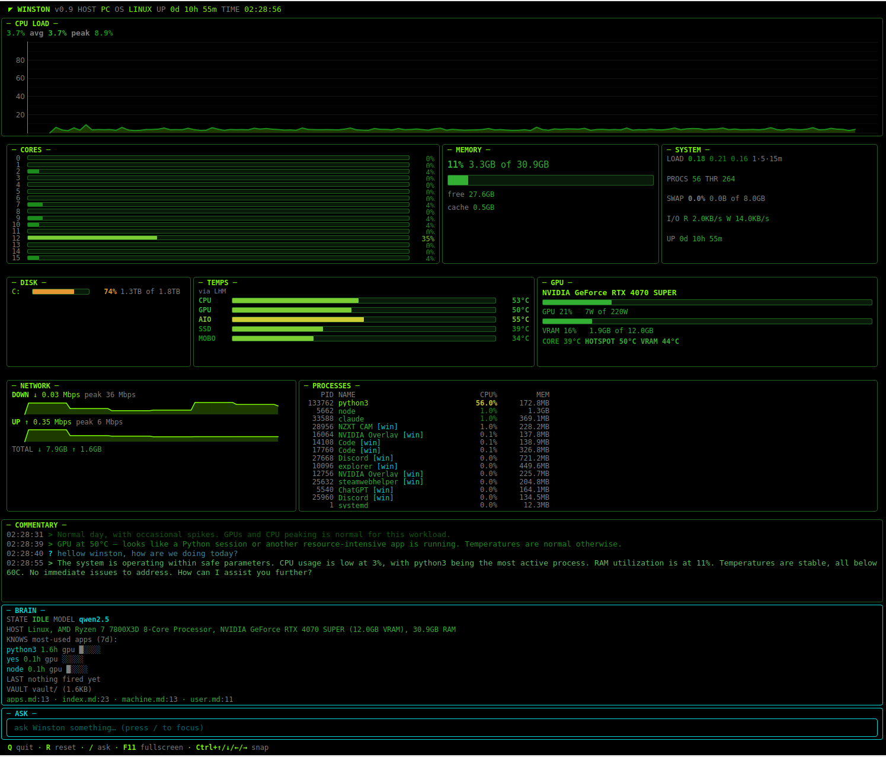
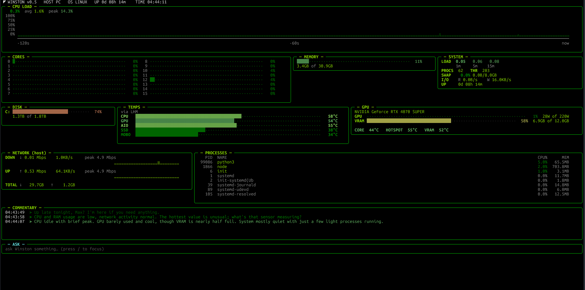
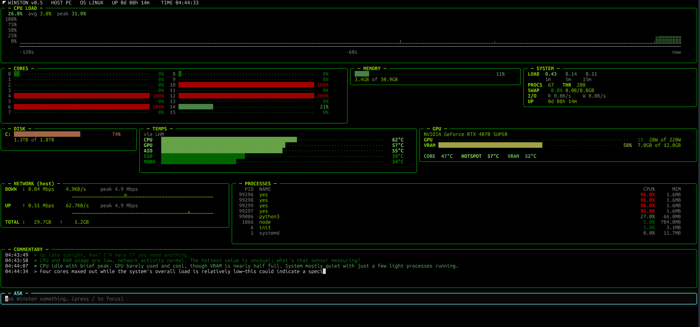

<h1 align="center">W I N S T O N</h1>

<p align="center">
  <b>W</b>ell-trained &nbsp;·&nbsp; <b>I</b>ntuitive &nbsp;·&nbsp; <b>N</b>eural &nbsp;·&nbsp; <b>S</b>ystem &nbsp;·&nbsp;
  <b>T</b>ranslating &nbsp;·&nbsp; <b>O</b>bserved &nbsp;·&nbsp; <b>N</b>umbers
</p>

A personal system monitor with a local-LLM butler. Watches CPU, RAM, GPU, disks, network, temperatures, and processes. Logs everything to CSV. Ollama reads the panel state and writes dry, observant commentary — both on a heartbeat and event-driven when something noteworthy happens. Two frontends share the same engine: a PyQt6 desktop app (`--gui`) and a Textual TUI (default).

## Quick links

- [Run it](#run)
- [Panels](#panels)
- [Commentary, memory, and tiered LLM](#commentary-memory-and-tiered-llm)
- [Architecture](#architecture)
- [WSL setup (temps + network)](#wsl-setup-temps--network)
- [Diagnostic env vars](#diagnostic-env-vars)
- [Project layout](#project-layout)
- [Roadmap](#roadmap)

## Stack

[Textual](https://github.com/Textualize/textual) + [Rich](https://github.com/Textualize/rich) (TUI), [PyQt6](https://pypi.org/project/PyQt6/) + [pyqtgraph](https://pyqtgraph.org/) (GUI), [psutil](https://github.com/giampaolo/psutil), [pynvml](https://pypi.org/project/pynvml/) (optional), [LibreHardwareMonitor](https://github.com/LibreHardwareMonitor/LibreHardwareMonitor) (optional, for WSL temps), [Ollama](https://ollama.com) (optional, for commentary).

## GUI (desktop)

`python winston.py --gui` — native PyQt6 window, GPU-accelerated charts via pyqtgraph, scrollable, smooth at 60 fps even while gaming.


*Same panels as the TUI plus the BRAIN view (state · model · top apps · vault).*

## CLI (TUI)

`python winston.py` — runs in any terminal, hand-rolled braille graphs, full keyboard control.


*Idle — greeted, summarized the day, sitting quietly.*


*Triggered — `yes > /dev/null` on four cores. The `single_core_pegged` trigger fired.*

## Run

```bash
pip install textual psutil pynvml PyQt6 pyqtgraph
ollama pull qwen2.5:3b-instruct           # routine commentary
ollama pull qwen2.5:7b-instruct           # loaded on demand for /-asked questions
python winston.py                          # TUI (default)
python winston.py --gui                    # PyQt6 desktop app
```

`Q` quit · `R` reset graphs · `/` focus the ASK input. GUI also has `F11` fullscreen and `Ctrl+↑/↓/←/→` snap.

All tunables live in `config.py` (refresh rates, LLM behavior, trigger thresholds). `winston.py` is just imports + the section list.

## Panels

| Panel | Rate | What |
| --- | --- | --- |
| **CPU LOAD** | 4 Hz | Hand-rolled scrolling braille graph (htop/btop-style). |
| **CORES** | 4 Hz | Per-core bars, 8-sample MA so blips don't flicker. |
| **MEMORY** | 2 Hz | Single bar with `X of Y` size inline. |
| **SYSTEM** | 0.5 Hz | Load avgs, procs, threads, swap, disk I/O, uptime. |
| **DISK** | 0.1 Hz | Disk usage. Skips WSL `/` (vhdx on `C:`). |
| **TEMPS** | 1 Hz | One row per device category — best representative sensor each, BIOS trip-points and firmware placeholders filtered. |
| **GPU** | 2 Hz | Util + power inline, VRAM + size inline, CORE/HOTSPOT/VRAM temps inline. |
| **NETWORK** | renders 2 Hz, host source polled **every 5 s** | Windows host stats via PowerShell (sees Chrome traffic). 5 s is intentional — see [the investigation](#investigation-networkpanel-and-dropped-keystrokes) below. |
| **PROCESSES** | 1 Hz | Top 14 by CPU, merged from psutil (Linux/WSL) + PowerShell `Get-Process` (Windows host, daemon-cached every 5 s). Windows rows tagged `[win]`. |
| **COMMENTARY** | event-driven | LLM-generated; see next section. |
| **BRAIN** | 1 Hz, dirty-checked | Winston's internal state — current model, top apps from memory, last trigger fired, MD vault summary. Toggleable via `SHOW_BRAIN_PANEL`. |

## Commentary, memory, and tiered LLM

A local Ollama model reads panel state and writes dry one-liners. Three trigger paths:

1. **Startup ritual** — time-aware greeting (`Good morning, max.` / `Up late tonight, max?`) followed by a one-line retrospective from the last 24h of logs.
2. **Event-driven** — `brain/triggers.py` evaluates per-second triggers (single core pegged, sustained CPU, thermal alerts, memory pressure, network burst, new heavy process). When one fires, Winston comments on the specific event.
3. **Heartbeat** — every `HEARTBEAT_INTERVAL_SEC` (default 5 min) a routine status comment so Winston isn't silent during quiet periods.

Output streams token-by-token via a typewriter buffer (decouples LLM gen rate from display rate). Press `/` to focus the ASK input and ask a question — last 3 Q&A pairs are kept as multi-turn context.

### Tiered model loading (so VRAM stays free for games)

Both models default to `keep_alive=0` — they load on demand, generate the answer, and unload immediately. Between commentaries, Winston holds zero VRAM. Cold loads are quick because Ollama keeps the weights in system RAM:

| Path | Model | Cold load | Triggers |
| --- | --- | --- | --- |
| Greeting, retrospective, heartbeat, routine, all triggered events | **qwen2.5:3b-instruct** (~2 GB) | 1-3 s | Startup ritual, every 5 min heartbeat, occasional event triggers |
| User questions via `/` | **qwen2.5:7b-instruct** (~6 GB) | 5-10 s | Only on `/`-ask |

You'll see "thinking…" for that brief window each time Winston has something to say. Bump `LLM_FAST_KEEP_ALIVE_SEC` or `LLM_QUALITY_KEEP_ALIVE_SEC` in `config.py` (e.g. to 60-300) if you want quick follow-ups at the cost of VRAM idle.

### Persistent memory + MD vault

`brain/memory.py` keeps a JSON file at `logs/memory.json` (gitignored) — top apps from log scan, behavioral fingerprints (avg CPU/GPU when each app is top-1), machine facts (CPU, GPU, RAM). Threaded into every prompt builder so commentary is personalized.

On every save the same facts are mirrored to `vault/{index,user,machine,apps}.md` — a human-readable markdown vault you can open in Obsidian, Logseq, or `cat`. JSON is canonical; the vault is derived. The BRAIN panel shows the vault path + page count so it stays discoverable.

## Architecture

### Master frame loop (30 FPS)

The whole dashboard refreshes on a single 30 Hz clock (`FRAME_HZ` in `config.py`). One `set_interval` in `display.py:WinstonApp.on_mount` drives `_frame_tick`, which checks each panel's per-panel rate and only fires `panel.update()` when due. Widget refreshes are batched per frame so Textual's compositor sees one coherent pass instead of 14 uncoordinated ones.

Why it matters: visual consistency (no panel jitter from mismatched cadences) and input responsiveness (asyncio loop has time to read keystrokes between frames).

### The 5 ms rule: heavy work goes on a thread

Anything that takes more than ~5 ms must run on a daemon thread. The UI panel just reads from a thread-safe cache. This is how btop adds 30 panels without lagging.

| Thread | Module | Why |
| --- | --- | --- |
| `winston-lhm-poller` | `panels/lhm.py` | LHM HTTP fetch — GPU and Temps panels share the cache. |
| `winston-net-poller` | `panels/network.py` | PowerShell `Get-NetAdapterStatistics` (50-200 ms each). |
| `winston-gpu-poller` | `panels/gpu.py` | pynvml driver calls (11-40 ms spikes on WSL). |
| `winston-llm-worker` | `brain/client.py` | Ollama HTTP streaming. |

### LLM calls are FIFO, single-flight

`brain/client.py` runs *one* worker thread with a `queue.Queue`. Reasons: UI thread never blocks on Ollama (calls take seconds), and parallel calls would just thrash a single GPU. FIFO matches user expectations.

### Lazy stream timers in CommentaryPanel

The typewriter (25 Hz) and cursor blink (2.5 Hz) timers are only scheduled while a stream is in flight. Idle Winston has zero CommentaryPanel timers running.

### Two frontends, one orchestrator

Winston ships two frontends — `cli/display.py` (Textual TUI, default) and `gui/main.py` (PyQt6 desktop, `--gui`) — and the LLM commentary logic lives in **neither**. It lives in `brain/commentary_engine.py:CommentaryEngine`, which owns:

- The state machine (THINKING / STREAMING / IDLE / ERROR / DISABLED)
- Q&A history + multi-turn context (last 3 pairs)
- Streaming buffer + typewriter cursor advancement
- Trigger evaluation (the 7 triggers in `brain/triggers.py` plus the 1Hz busy-gate / heartbeat / stale-quiet rules)
- Prompt-building dispatch (`build_greeting / build_retrospective / build_triggered / build_observation / build_conversational`)
- Model tier selection

Each frontend is a thin renderer + timer driver that calls into the engine. Adding a third frontend (web, mobile) just means writing another renderer — no LLM logic to duplicate.

Why this matters: when we first added the GUI, the trigger evaluation got duplicated and rules drifted between frontends. Extracting into the engine fixed both copies at once and means future trigger / heartbeat tweaks live in one place.

### Investigation: NetworkPanel and dropped keystrokes

This bug took a while to find — keeping the writeup short here, but it's worth knowing why `NETWORK` polls so slowly.

Symptom: typing into the ASK input dropped ~1 in 20 characters. Felt like network lag, but local.

What it actually was: `panels/network.py` polls `Get-NetAdapterStatistics` via PowerShell on a daemon thread. Every poll spawns a fresh PowerShell process across the WSL→Windows boundary — 50-200 ms of process creation per call. Even though `subprocess.run()` releases the GIL during the wait, the GIL handoffs around subprocess return + `text=True` decoding repeatedly poked the asyncio loop, and stdin reading occasionally lost a character to the noise.

Tested 0.5 s / 2 s / 5 s polling: 0.5 s dropped 1 in 20, 2 s dropped occasional letters, **5 s clean**. So `POLL_INTERVAL_SEC = 5.0` in `panels/network.py`, with a comment.

Confirmed via `WINSTON_NO_NET=1` (typing perfect) vs `WINSTON_NO_LHM=1` (typing still dropped) — only the cross-OS PowerShell path causes drops. LHM JSON parsing on its thread doesn't, because that work is local; same for pynvml via ctypes.

Proper future fix: keep a long-lived PowerShell session and pipe queries to its stdin — eliminates per-call process churn, can go back to 1-2 Hz polling. ~30 line change.

## Diagnostic env vars

For chasing future UI lag or input drops:

```bash
# Disable background threads (bisect GIL contention):
WINSTON_NO_THREADS=1   # both NetworkPanel and LHM threads off
WINSTON_NO_NET=1       # only NetworkPanel thread off
WINSTON_NO_LHM=1       # only LHM thread off

# Disable specific panel ticks (they still draw their primed values):
WINSTON_DISABLE_PANELS=GpuPanel,StatusBar python3 winston.py

# Catch slow ticks (logs to /tmp/winston_timing.log):
WINSTON_TIMING=1 WINSTON_TIMING_MS=5 python3 winston.py
```

## WSL setup (temps + network)

WSL2 doesn't include lm-sensors, and its virtual NIC only sees traffic launched from inside WSL. Winston bridges to Windows for both.

### LibreHardwareMonitor (for temps)

```powershell
winget install LibreHardwareMonitor.LibreHardwareMonitor
```

Launch as Administrator, then:
- **Options → Remote Web Server → Run** (port 8085)
- **Options → Run On Windows Startup**
- **Options → Minimize To Tray**

Firewall (PowerShell as Admin):

```powershell
New-NetFirewallRule -DisplayName "LHM Web Server (WSL only)" `
  -Direction Inbound -LocalPort 8085 -Protocol TCP -Action Allow `
  -Profile Any -RemoteAddress 127.0.0.1,172.16.0.0/12
```

Locked to localhost + WSL subnet only. Winston auto-detects the Windows host IP from `/proc/net/route`.

### Ollama (for commentary)

Install Ollama on Windows. Same firewall pattern as LHM, port `11434`. Pull both models so tiering works (the 3B is the resident one and the only one that truly needs to be there):

```powershell
ollama pull qwen2.5:3b-instruct
ollama pull qwen2.5:7b-instruct
```

## Project layout

```
winston.py              # entry point — picks frontend via --gui flag
config.py               # all tunables (FRAME_HZ, GPU_BUSY_*, panel hz, LLM, triggers)
theme.py                # color decisions: heat_pct() / heat_temp() helpers
logger.py               # 1 Hz CSV writer
input_test.py           # standalone Textual harness for input-drop debugging

panels/                 # data layer — SHARED across frontends
  base.py               # bar gauges, braille graph, fmt_bytes
  cpu_graph.py          # CPU-history data class
  cpu.py · ram.py · system.py · disk.py · processes.py
  temps.py              # multi-backend (native/LHM/WMI), smart device labels
  gpu.py                # pynvml/nvidia-smi + LHM enrichment, own poll thread
  network.py            # PowerShell host stats (5 s poll), smoothed, peak-tracked
  lhm.py                # shared LHM HTTP poller (background thread, single cache)
  brain.py              # BRAIN panel data class (rendered by both frontends)

brain/                  # LLM layer — SHARED across frontends
  client.py             # Ollama client; FIFO worker thread
  prompt.py             # all prompt builders
  baselines.py          # rolling mean/stddev for anomaly detection
  triggers.py           # the 7 trigger functions + TriggerRunner
  history.py            # single-pass O(n) CSV scanner
  memory.py             # persistent JSON-backed user memory
  vault.py              # MD mirror of memory.json — vault/*.md regenerated on save
  commentary_engine.py  # backend-agnostic orchestrator — state machine,
                        # trigger evaluation, heartbeat, stale-quiet,
                        # Q&A history. Both frontends consume this.

cli/                    # TUI frontend — only renders engine state
  display.py            # Textual app + CommentaryPanel renderer
  ui/ask.py             # legacy modal popup (not currently wired)

gui/                    # desktop frontend — only renders engine state
  main.py               # PyQt6 + pyqtgraph; QMainWindow + view widgets

logs/                   # gitignored
  raw/observations.csv  # 1 row/sec time-series CSV
  memory.json           # canonical persistent memory
  reasoning.jsonl       # every prompt + response (canonical, machine-parseable)
  reasoning.log         # same events, human-readable mirror

vault/                  # gitignored — markdown mirror of memory.json
  index.md · user.md · machine.md · apps.md
```

**Adding a panel:** drop a class in `panels/` with `update()`, `render(width=None)`, `csv_headers()`, `csv_columns()`. Add it to the section list in `winston.py` and a layout slot in BOTH `cli/display.py` (`compose()`) and `gui/main.py` (`WinstonGui.__init__` row layout). The data class is shared.

**Adding a trigger:** write a function in `brain/triggers.py` taking `(sections, baselines, cfg)` and returning a `TriggerEvent` or `None`. Register it in `TRIGGER_FUNCTIONS` and add a config block in `config.py:TRIGGERS`. Both frontends pick it up automatically — the engine evaluates all registered triggers at 1 Hz.

**Adding anything that does I/O, subprocess, or syscalls:** put the slow work on a daemon thread. UI panel reads from a lock-guarded cache. See [the 5 ms rule](#the-5-ms-rule-heavy-work-goes-on-a-thread).

## Roadmap

See [`TODO.md`](TODO.md). Short version of what's next:

- **5.5b** — fully tier-aware preemption (notable preempts routine mid-stream, not just alerts).
- **5.6** — tools the LLM can call (`read_log`, `get_process_details`, `query_baseline`).
- **5.7** — refactor: split `display.py` and `panels/temps.py` along natural seams.
- **5.8** — cleanups from v0.8 review (memory schema dedup, throttle commentary repaints to FPS clock, more usage-pattern tools).
- **9** — process graph view (`G` opens an Obsidian-style force-directed graph; nodes = processes, size = memory, color = CPU).

## Why "Winston"

The backronym came after the name. The idea: an AI butler watching over your machine. Always knows what's going on, quietly notices when things are off, tells you what matters.
